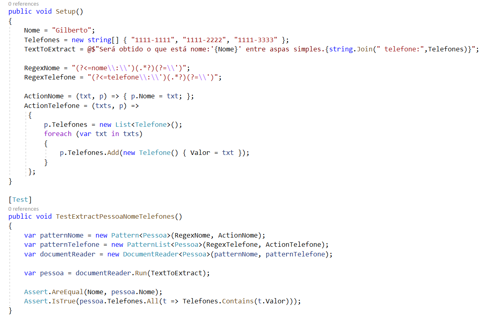

#TextReaderByPattern
Biblioteca para leitura leitura e transformação de texto em objetos baseada em expressões regulares</h2>

A Partir de uma entrada de texto são identificados os padrões(Regex) passados e retornado o objeto preenchido.

